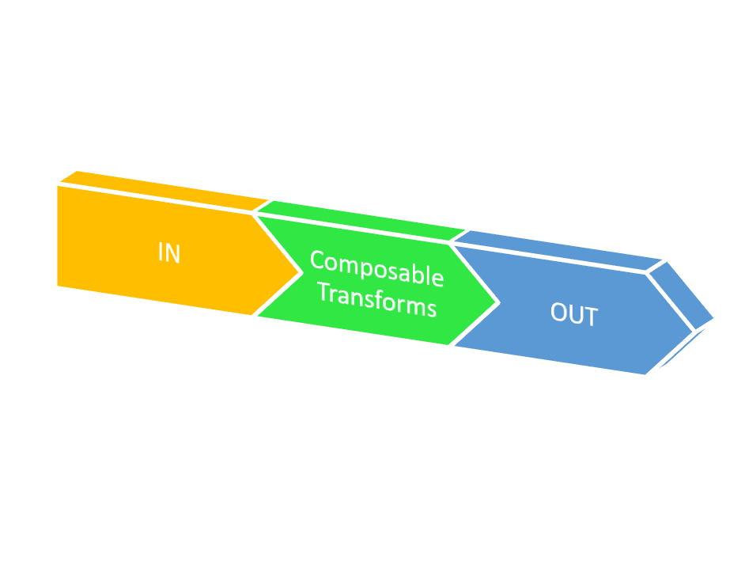

<h1> Robust-transformer </h1>

Robust Transformer is an end-to-end functional style distributed data transformation pipeline built on top of Google JAX

  

`split_shuffle(*, key: jax.numpy.lax_numpy.ndarray, raw_data: pandas.core.frame.DataFrame, n: int) -> Dict[str, pandas.core.frame.DataFrame]`
